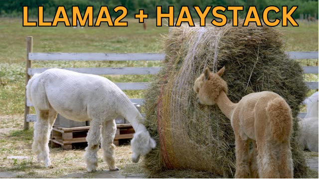

# llama2-haystack
**(Experimental) Using Llama2 with Haystack**

The [notebook](llama2-haystack.ipynb) contains my hacky experiments in which I try to load and use [Llama2](https://ai.meta.com/llama/) with [Haystack](https://github.com/deepset-ai/haystack), the NLP/LLM framework.

*It's nothing official or well refined, but perhaps it may be useful to other people experimenting.*

